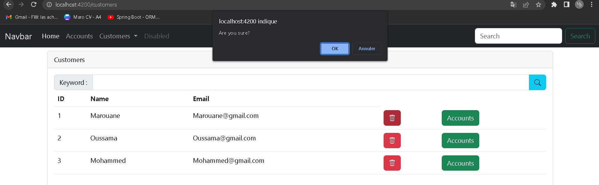

<h1 align="center">Partie Frontend</h1>
 

### -Consultation des clients

Dans cette catégorie, vous trouverez une liste des clients existants avec leurs informations associées. Une fonctionnalité de recherche par mot-clé est disponible, ce qui facilite le filtrage des clients. Chaque client est représenté sous forme d'une entrée dans un tableau, affichant des détails tels que l'identifiant, le nom et l'adresse e-mail. Vous disposez de deux options : la suppression du client ou l'accès à ses comptes, accessibles via des boutons dédiés.
 

 

### -Supprimer le client

 

### - Ajout de nouveaux clients

Dans cette section, les utilisateurs peuvent ajouter de nouveaux clients à l'application. Une interface affiche un formulaire contenant les champs obligatoires tels que le nom et l'adresse e-mail. Des vérifications sont effectuées sur ces champs pour garantir l'exactitude des données fournies. Pour enregistrer le nouveau client, il suffit à l'utilisateur de cliquer sur le bouton "Enregistrer".

 

### - les requis

 

### -l'ajout

 

## Comptes bancaires et opérations

La fonctionnalité des comptes bancaires permet d'accéder aux détails d'un compte spécifique et d'effectuer diverses transactions financières.

 

Cette section se divise en deux parties distinctes :

- La première partie met en évidence les informations relatives à un compte bancaire spécifique, y compris son identifiant unique et le solde disponible. Elle affiche également un historique des opérations effectuées sur ce compte, avec l'identifiant, la date, le type et le montant de chaque opération.

- La seconde partie offre à l'utilisateur la possibilité d'effectuer des transactions financières sur le compte sélectionné. Différentes options sont disponibles, telles que le débit, le crédit et le transfert. Si l'option de transfert est choisie, un champ supplémentaire apparaît pour spécifier le compte de destination. L'utilisateur est également invité à saisir le montant de l'opération ainsi qu'une brève description. Une fois toutes les informations saisies, il peut enregistrer l'opération en cliquant sur le bouton approprié.

 

### -DEBIT

 

### -CREDIT

 

### -TRANSFER

 

## Conclusion

L'analyse a porté sur la composante frontend de l'application web Digital Banking, développée à l'aide du framework Angular. L'interface utilisateur permet aux utilisateurs de parcourir les clients enregistrés, d'ajouter de nouveaux bénéficiaires, de visualiser les informations détaillées des comptes bancaires, de consulter l'historique des opérations effectuées et d'effectuer de nouvelles transactions financières telles que les débits, les crédits et les transferts. Cette application offre une expérience utilisateur ergonomique pour gérer efficacement et en toute sécurité les opérations bancaires en ligne.
